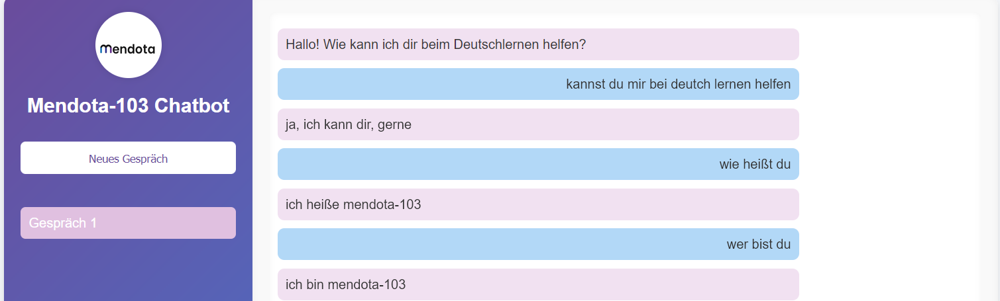

# Mendota - AI Chatbot

Mendota is an advanced AI chatbot trained on over 50,000+ German sentences, designed to provide high-quality conversational responses. Built using **PyTorch**, Mendota leverages modern neural network architectures to simulate human-like interactions, making it an ideal tool for educational purposes, personal assistants, and general conversational applications. Mendota’s goal is to engage users in natural dialogue while continuously learning from interactions to improve its performance.



## Features

- **German Language Support**: Mendota is designed to understand and respond in German, trained on a vast dataset consisting of 50,000+ German sentences across various topics.
- **State-of-the-art AI Model**: Utilizes an advanced neural network architecture based on **Recurrent Neural Networks (RNNs)** with **Attention Mechanism** to generate contextually aware responses.
- **PyTorch Framework**: Built with **PyTorch**, a popular deep learning library, to ensure flexibility, performance, and scalability.
- **Continuous Learning**: While not currently a real-time learning model, future updates aim to enable Mendota to improve its responses through ongoing interaction.

## Model Details

- **Dataset**: The chatbot was trained on a dataset containing more than **50,000 German sentences** covering various topics, from basic greetings to complex daily life conversations.
- **Architecture**: The model employs **GRU (Gated Recurrent Unit)** layers and an **Attention mechanism**, which helps Mendota better understand the context of user input and produce coherent, context-aware replies.
- **Training**: Training was conducted on a system with **GPU support** to ensure faster processing. The model has been optimized to handle diverse conversations with a focus on **grammar, sentence structure**, and **natural language understanding**.

## Installation

To run Mendota locally, you can clone this repository and install the necessary dependencies.

```bash
git clone https://github.com/yourusername/mendota.git
cd mendota
pip install -r requirements.txt
```
## Requirements
- **Python 3.7+**
- **PyTorch** (With CUDA Support)
- **Flask**
## Training

Mendota was trained using a high-performance machine equipped with **CUDA** for GPU acceleration. The training process involved optimizing the model using **Adam optimizer** and adjusting the learning rate dynamically through a **scheduler** to ensure efficient convergence. The training lasted for several epochs and utilized techniques like **gradient clipping** to stabilize the training process and prevent overfitting.

### Training Steps:

1. **Data Preprocessing**:
   - The training data consists of over **50,000** German sentences. Each sentence pair (question-answer) is tokenized, lowercased, and padded to a fixed sequence length. This ensures that all input sequences are of equal length, allowing for efficient batch processing during training.
   - The data is then split into **input sequences** and **target sequences**, and both are padded with a special **<pad> token** to handle varying sentence lengths.

2. **Model Setup**:
   - The model architecture includes a **GRU (Gated Recurrent Unit)**, which is effective for sequential data and handles long-term dependencies. 
   - An **Attention mechanism** is added on top of the RNN to allow the model to focus on important parts of the input sequence, improving context understanding.
   - The final layer is a **Fully Connected (FC) layer**, which outputs a prediction of the next word in the response.

3. **Loss Function**:
   - The model uses **Cross-Entropy Loss** as the loss function. This function calculates the error between the predicted output (probabilities for each word in the vocabulary) and the actual target sequence. The model then minimizes this loss function during training.

4. **Optimization**:
   - The **Adam optimizer** is used for training. Adam is an adaptive learning rate optimizer that is known for its efficiency and performance in deep learning tasks.
   - To avoid overfitting and ensure stable training, **gradient clipping** is applied. This technique limits the gradients during backpropagation to a maximum threshold, preventing large updates that could destabilize the model.

5. **Learning Rate Scheduling**:
   - A **Learning Rate Scheduler** is used to adjust the learning rate dynamically during training. The learning rate starts at an initial value and is reduced as training progresses, which helps the model converge smoothly.
   - The scheduler is set to reduce the learning rate if the model's performance on the validation set doesn't improve for a certain number of epochs (patience).

### Training Environment:
- The training is performed on a machine with a **GPU** (CUDA-enabled) to accelerate the model's computations.
- The **PyTorch** framework is used for building, training, and evaluating the model.
- The training process is distributed across multiple epochs, where each epoch involves running the entire dataset through the model and adjusting weights based on the calculated gradients.

### Training Process:

The training process involves the following steps:

1. **Forward Pass**: 
   - Input sequences are passed through the **embedding layer**, which converts words into vectors of fixed size.
   - The embedded sequences are then fed into the **GRU layers**, which process the sequences and output a hidden state.
   - The **Attention layer** is used to improve the model's focus on relevant parts of the input sequence.
   - Finally, the output is passed through a **fully connected layer** to generate predictions.

2. **Backward Pass**: 
   - The model calculates the gradients based on the loss function and updates the weights through backpropagation.
   - The optimizer adjusts the weights in the direction of the gradients, and the model gets closer to minimizing the loss.

3. **Epoch Completion**: 
   - After processing all the training data, the model evaluates its performance and adjusts the learning rate.
   - If the model performs better on the training set, the learning rate is adjusted, and the model is saved if the loss improves.
   
4. **Validation**:
   - After every few epochs, the model's performance is evaluated on a **validation set** (a portion of the dataset not seen during training) to check for overfitting.
   - If the validation performance does not improve after a certain number of epochs, **early stopping** is applied to prevent overfitting and save computational resources.

### Results:
- The training process lasts for several epochs, and the model progressively learns better responses.
- The final trained model can generate coherent and contextually aware replies to user inputs in German.
## Usage

To interact with **Mendota**, you can use the trained model through a web interface or directly via Python code. Below are the instructions for both approaches.

### 1. Starting the Mendota-103:

After running the Flask server, you can interact with **Mendota** by sending GET requests to the following endpoint:
```bash
python main.py
```
Once the bot is running, you can make requests to interact with Mendota through the API or a simple command-line interface.
### Example API Request:
```bash
curl "http://localhost:3364/ask?question=Wie%20geht%20es%20dir?"
```
### Example Output:
```json
{
  "response": "Mir geht es gut, danke."
}
```


